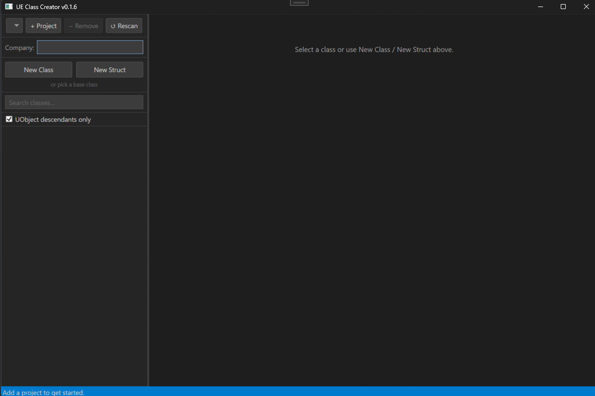

# Getting Started

## Installation

Download the latest installer from the [Releases](../../releases) page and run it. The installer is per-user by default — no UAC prompt required.

**Requirements:** Windows 10/11 (64-bit). The installer includes the .NET 10 runtime; no separate download needed.

## First Launch

On first launch you'll see **"Add a project to get started."** The tool is project-centric — you point it at a `.uproject` file and it takes care of locating the associated Unreal Engine installation from there.



## Adding a Project

Click **Add Project** and select your `.uproject` file. The engine is resolved using the following lookup chain:

1. **Co-located source build** — if an `Engine/` folder exists next to your project directory (the UGS layout), that engine is used directly
2. **Registry (HKLM)** — launcher binary installs keyed by version string
3. **Registry (HKCU)** — source builds registered by GUID
4. **LauncherInstalled.dat** — `C:\ProgramData\Epic\UnrealEngineLauncher\LauncherInstalled.dat` as a final fallback

Once the engine is found, header scanning starts in the background automatically.

You can add multiple projects and switch between them with the dropdown at the top of the window. To remove one, select it and click **− Remove** — this clears its saved output path and last-selected class, but doesn't touch any files on disk.

## Header Scanning

On first load the tool scans:

- `{EnginePath}/Engine/Source/` — all engine source headers
- `{EnginePath}/Engine/Plugins/` — engine plugin headers
- `{ProjectDir}/Source/` — your project's source headers
- `{ProjectDir}/Plugins/` — your project's plugin headers

A progress counter is shown in the status bar while scanning. On a typical launcher-installed engine this takes a few seconds.


### Caching

Scanned engine classes are cached to `%LOCALAPPDATA%\UEClassCreator\cache\`.

| Engine type | Cache invalidation |
|---|---|
| Launcher install | Automatic — invalidated when `Engine\Build\Build.version` changes |
| Source build (UGS) | **Manual only** — UGS syncs bump `Build.version` on every pull even when no headers changed, so the cache is never auto-invalidated. Click **Rescan** after pulling significant engine changes. |

Project classes are always rescanned at startup (fast, small set).

## Building from Source

```
git clone <repo-url>
cd UnrealEngineClassCreator
dotnet build
dotnet run --project UEClassCreator
```

To produce a self-contained release build:

```powershell
.\Installer\Publish-Release.ps1 -Bump patch
```

This bumps the version, publishes a win-x64 self-contained binary, and compiles the Inno Setup installer to `Installer/Output/`.
