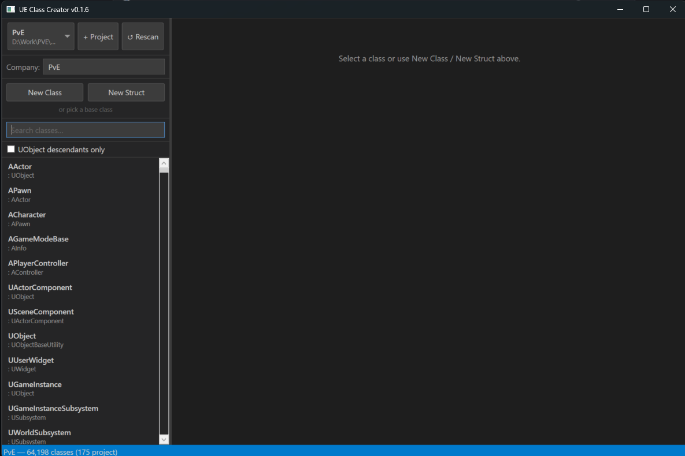

# UE Class Creator

A fast, offline Windows desktop tool for generating Unreal Engine C++ class boilerplate.

[Download latest release](https://github.com/KeeganLGibson/UnrealEngineClassCreator/releases/latest)



---

## Features

- **Fast as-you-type search** — filters the full engine and project class index instantly as you type, matching both class name and parent class name
- **Inheritance context** — selecting a class shows its full ancestry chain and up to 5 direct subclasses; every entry is clickable to navigate the hierarchy
- **Common classes pinned** — when search is empty, `AActor`, `APawn`, `ACharacter`, `AGameModeBase`, `APlayerController`, `UActorComponent`, `USceneComponent`, `UObject`, `UUserWidget`, `UGameInstance`, `UGameInstanceSubsystem`, and `UWorldSubsystem` appear at the top
- **UObject-only filter** — checkbox to narrow results to `UObject`-derived classes
- **Standalone class/struct creation** — create a class or struct with no parent class when you need a plain C++ type
- **Automatic engine discovery** — resolves engines from co-located source builds, registry, and `LauncherInstalled.dat`
- **Game project and plugin scanning** — indexes your project's `Source/` and `Plugins/` directories alongside the engine
- **Smart Public/Private output routing** — automatically places `.h` in the `Public` branch and `.cpp` in `Private` based on your chosen path
- **Mustache templates** — generates `.h` + `.cpp` pairs with correct `#include` paths, `UCLASS()`, `GENERATED_BODY()`, and module-aware include ordering
- **Per-project template overrides** — drop custom templates into `{ProjectDir}/build/ClassCreator/` to override defaults for that project
- **Persistent settings** — remembers your last output path and selected class per project
- **Class name prefix hints** — warns if your class name is missing the expected `A` or `U` prefix for the selected parent type
- **Update notifications** — checks GitHub releases at startup and shows a banner when a newer version is available
- **Fully offline** — no network dependency beyond the optional update check

---

## Example Output

Creating `AMyActor` with parent `AActor` produces:

**`Public/MyActor.h`**
```cpp
//  MyProject
//
//  2026(c) - Copyright MyCompany
//
//  File Name   :   MyActor.h
//  Description :   TODO:
//

#pragma once

// Library Includes
#include "GameFramework/Actor.h"

// Local Includes

// This Includes
#include "MyActor.generated.h"

// Types

// Constants

// Prototypes

// TODO:
UCLASS()
class AMyActor : public AActor
{
	GENERATED_BODY()
	// Member Functions
public:

protected:

private:

	// Member Variables
public:

protected:

private:

};
```

**`Private/MyActor.cpp`**
```cpp
//  MyProject
//
//  2026(c) - Copyright MyCompany
//
//  File Name   :   MyActor.cpp
//  Description :   TODO:
//

// This Includes
#include "MyActor.h"

// Library Includes

// Local Includes

// Generated CPP
#include UE_INLINE_GENERATED_CPP_BY_NAME(MyActor)

// Static Variables

// Static function prototypes

// Implementation
```

---

## Pages

- [Getting Started](getting-started) — installation, adding your first project, engine discovery
- [Usage Guide](usage) — search, class selection, generating files, settings
- [Output Path Routing](output-routing) — how Public/Private path splitting works
- [Templates](templates) — custom templates and template variable reference
