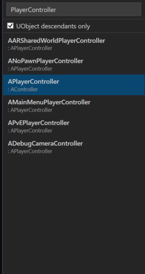
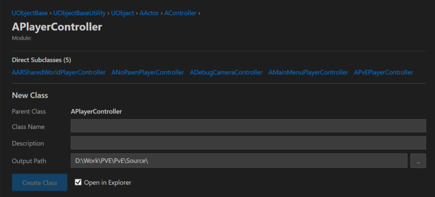
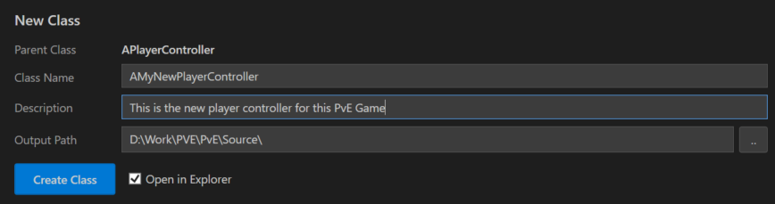

# Usage Guide

---

## Searching for a Class

Type in the search box on the left. Results update after a 200 ms debounce.

Search matches against both the **class name** and the **parent class name**, so typing `Actor` will surface `AActor`, `ACharacter`, `APlayerController`, and anything else whose parent contains "Actor".

Results are ranked:
1. Exact match
2. Starts with query
3. Contains query (class name)
4. Parent-name match only

**When search is empty**, the following common base classes are pinned to the top of the list:

`AActor` · `APawn` · `ACharacter` · `AGameModeBase` · `APlayerController` · `UActorComponent` · `USceneComponent` · `UObject` · `UUserWidget` · `UGameInstance` · `UGameInstanceSubsystem` · `UWorldSubsystem`

### UObject-Only Filter

Check **UObject only** to narrow the list to classes that derive from `UObject`. Useful when you know you need a `UCLASS`-based type and want to exclude plain C++ structs and unrelated hierarchies.

---

## Selecting a Parent Class

Click any class in the results list to select it as the parent. The right panel updates to show:

- **Ancestry chain** — the full inheritance path from root to the selected class (e.g. `UObject → AActor → APawn → ACharacter`). Click any ancestor to select it instead.
- **Direct subclasses** — up to 5 are shown initially. Click **Show all** to expand the full list. Click any subclass to navigate to it.

---

## Generating a Class

With a parent class selected, fill in the generation form on the right:

| Field | Notes |
|---|---|
| **Class name** | The full class name including prefix, e.g. `AMyActor`. The tool warns if the name is missing the expected `A` prefix (Actor-derived) or `U` prefix (UObject-derived). |
| **Description** | Optional. Populates the `Description` field in the file header comment. Defaults to `TODO:` if left blank. |
| **Output path** | The directory to write files into. See [Output Path Routing](output-routing) for how `.h` and `.cpp` are split automatically. |

Click **Browse** to pick a folder, then **Create Class**.

After creation the status bar shows where the files were written. If **Open in Explorer after create** is enabled, Explorer opens to the output folder automatically.

---

## Standalone Class or Struct

You do not need to select a parent class. The **New Class** and **New Struct** buttons in the toolbar create a class or struct with no parent.

- **New Class** — generates a plain C++ class (no `UCLASS()` / `GENERATED_BODY()`)
- **New Struct** — generates a header-only struct file using `Struct.mustache`
  - Check **USTRUCT** to add `USTRUCT()` and `GENERATED_BODY()` macros

Struct generation is also triggered automatically when the selected parent class is an `F`-prefixed type (e.g. `FTableRowBase`).

---

## Settings

Settings are saved to `%LOCALAPPDATA%\UEClassCreator\settings.json` and persist across sessions.

| Setting | Where |
|---|---|
| **Company name** | Top of the right panel — used in the copyright header of generated files |
| **UObject only** | Search filter checkbox, persisted globally |
| **Open in Explorer after create** | Checkbox in the generation form area |

Per-project state (last output path, last selected class) is keyed to the `.uproject` path and restored automatically when you switch projects.

---

## Update Notifications

At startup the tool checks the GitHub releases page. If a newer version is available, a banner appears at the top of the window. Click the banner to open the release page in your browser.
